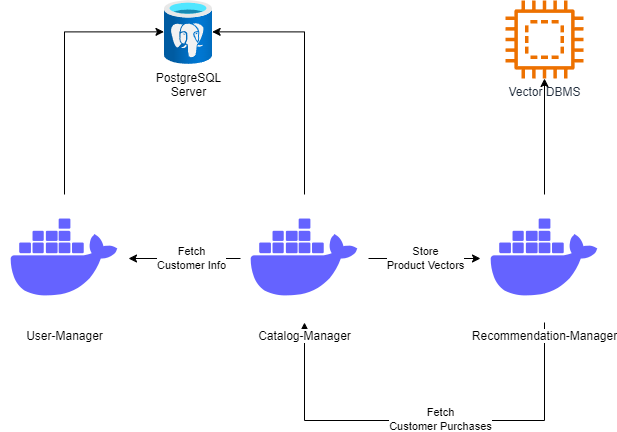
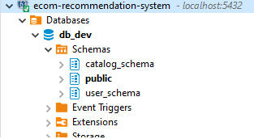
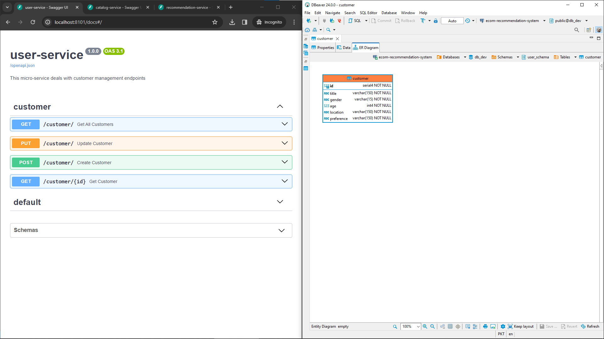
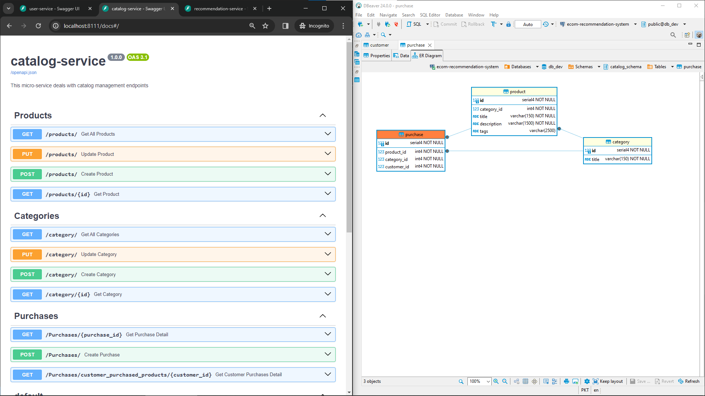
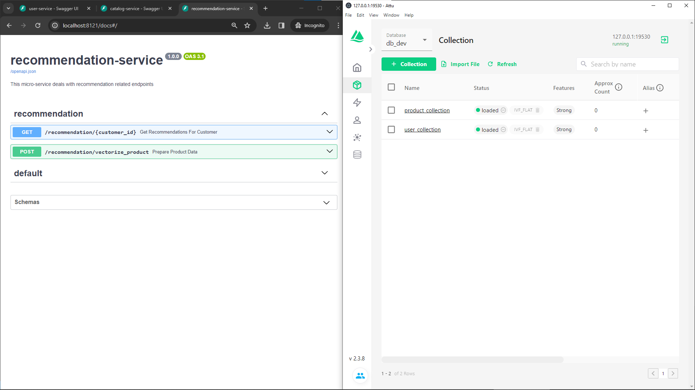
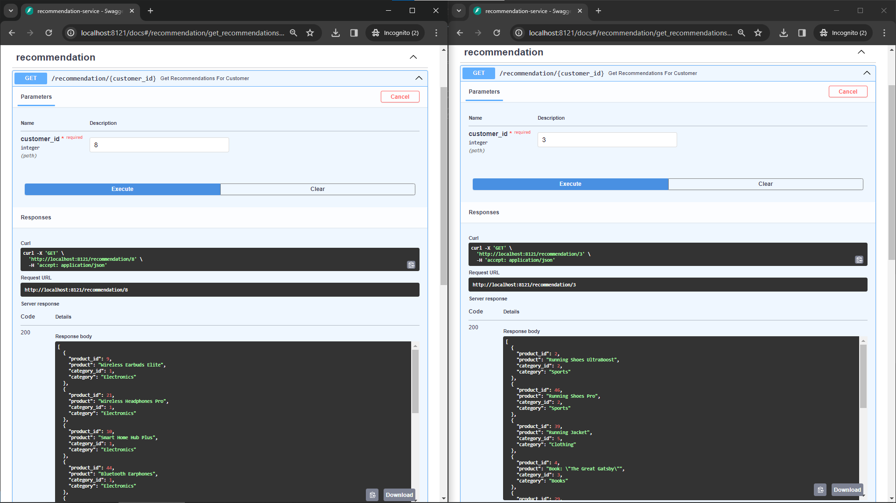

# ECom-Recommendation-System
This repository is developed as a task to develop recommendation system for an E-Commerce store. Along with this task sample [dataset.csv](dataset.csv) file is baseline data used to design and develop this system

## System Design
In order to achieve this task within given a week, following design was developed. 



3 micro-services and two different types of databases for this task.

----------------

As opposed to common micro-service architecture, a single PostgreSQL Server for simplicity. However, separate schemas for services were used and no inter-schema querying is being performed within the application. Following is the snapshot of different schemas used by the services



## Deployment
There is a [docker-compose.yml](docker-compose.yml) provided with the solution. System can be deployed using the following steps
```
cd path/to/ecom-recommendation-system
docker compose -f docker-compose.yml build

# Launch Databases
docker compose -f docker-compose.yml up db_service standalone -d

# Wait for 1 minute for DBs to initialize and then issue following command
docker compose -f docker-compose.yml up user_service recommendation_service -d

# Wait for 3-5 minutes here as downloading resources (first time) take a while.
docker compose -f catalog_service -d
```

Using docker-compose port mapping for each service is as follows

| Docker-URL | System-URL|
|------------|-----------|
|http://User-Manager:8000 | http://localhost:8101|
|http://Catalog-Manager:8000 | http://localhost:8111|
|http://Recommendation-Manager:8000 | http://localhost:8121|
|PostgreSQL-DBMS:5432 | localhost:5432|
|milvus-standalone:19530|localhost:19530|

Dockerfile of each service is also provided with the repo. Please have a look at accompanying .env files prior to launching the Dockerfiles directly
- [User-Service Dockerfile](./user-service/Dockerfile)
- [Catalog-Service Dockerfile](./catalog-service/Dockerfile)
- [Recommendation-Service Dockerfile](./catalog-service/Dockerfile)

As soon as services are ready, initial data from dataset.csv will be uploaded in PostgreSQL and Milvus. OpenAPI (Swagger) can be used to test the APIs by appending `/docs` at the end of System-URLs mentioned above.

## Components Overview
### User-Manager
This service is responsible to manage user/customer data. It is a simple CRUD application which populates user/customer with fields present in CSV file.



### Catalog-Manager
This service is responsible to manage category, product and purchases data. It is a simple CRUD application which populates user/customer with fields present in CSV file.



### Recommendation-Manager
This service is responsible to provide recommendations for a customer. It also exposes an endpoint which is used by catalog-manager to store product vectorized info in Milvus. This service fetches customer purchase information from catalog-manager, performs vector-based matching using available features and outputs the result.



Some sample recommendations for customer ids 3 and 8 are shown below



-------------------

## Technology-Stack
This project is entirely developed in python using FastAPI as web framework and SQLAlchemy as ORM. Development was done in containerized environment via VSCode

## Flaws
One obvious point missed during development was to remove self referencing recommendations. 
